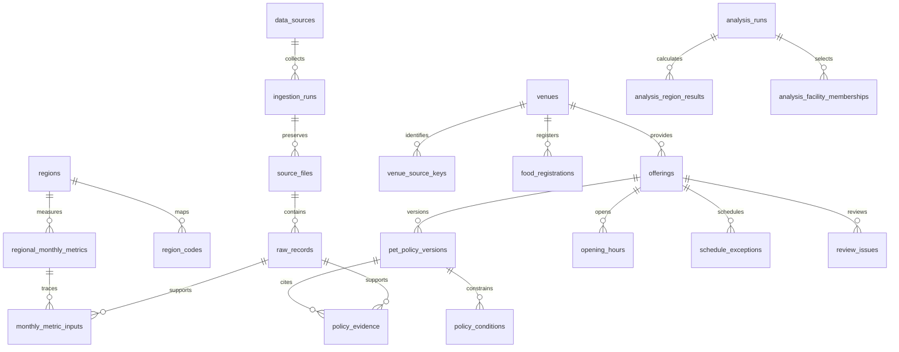

# 확보 데이터 목록과 DB 구조 설계

기준일: 2026-09-25 · 조사 범위: 현재 프로젝트의 `data/`, `runs/`, `outputs/`, 루트 결합 CSV 및 이번 WBS 2.3 조사 자료.

**장소, 객실·공간·프로그램, 동반 규정, 공식 출처를 분리해 저장한다.** 지역 선정 통계는 서비스 장소 데이터와 별도 영역으로 관리한다. 현재 `data/app.db`에는 `places(id, category, document JSON)` 한 테이블과 레코드 1건이 있다. 아래 SQL은 새 DB용 설계이며 기존 앱 DB를 교체하거나 수정하지 않았다.

파일별 크기·SHA-256·CSV 헤더/행 수는 [데이터 파일 목록](../outputs/policy_review_20260925/workspace_data_inventory.json), 이번 조사 출처는 [출처 목록](../outputs/policy_review_20260925/sources.json), 실행 가능한 테이블 정의는 [database_schema.sql](database_schema.sql)에 있다. 파일 수는 DB 행 수와 다르다. 외부 공유 드라이브나 다른 대화의 미첨부 자료는 이 목록에 포함하지 않았다.

## 1. 지금까지 확보한 데이터

| 구분 | 실제 경로 / 자료 | 확인한 규모 | 용도·적재 판단 |
|---|---|---:|---|
| 숙박방문자 비율 원본 | `data/raw/*숙박방문자 비율 추이(외지인).csv` | 5파일 × 24행 = 120행 | 5개 후보와 전국평균, 2025-09~2026-08. 분석에는 후보별 11개월 55행 사용 |
| 2025년 방문자 API 원문 | `runs/api_visitors_2025_live_01/raw/` | XML 294개 | 원문 보존, 현재 5도시 11개월 분석과 실행 이력 분리 |
| 2025년 월별 방문자 | 같은 폴더 `visitors_monthly.csv` | 3,168행 | 264지역 × 12개월; 숙박비율 준비 전 단계 |
| 2025년 지역 정리 | `runs/actual_visitors_2025_01/` | 229지역 순위, 월별 2,748행, 중복 행정구 35행 제외표 | 이전 분석 산출물. 최신 결합표와 중복 적재 금지 |
| 후보도시 일별 방문자 원문 | `runs/api_candidates_{sido,sigungu}_202509_202608/raw/` | 시도 XML 23개, 시군구 XML 285개 | 전체 실행은 failed지만 완전한 후보·월은 재검증하여 사용. 실패 자료 통째 폐기/통째 승인 모두 금지 |
| 현재 분석용 결합표 | `data/processed/city_202509_202607/region_monthly.csv` | 5지역 × 11개월 = 55행 | 승인할 분석 입력. `visitor_coverage.csv` 55행 및 감사 JSON과 함께 적재 |
| 루트 결합 CSV | `region_monthly.csv` | 위 55행과 SHA-256 동일 | 실행 편의용 사본. 독립 데이터셋으로 세지 않음 |
| 불완전·이전 결합표 | `data/processed/city_202509_202608/`, `previous_region_monthly.csv` | 60행 또는 2,748행 | 2026-08 방문자 불완전. 이전 버전으로 보존하고 기본 분석에서 제외 |
| 관광수요 순위 | `runs/city_selection_202509_202607_01/region_ranking.csv` | 5행 | 세 가지 가중치 시나리오의 점수·순위. 관측 원본과 분리 |
| 반려동물 목록 원문·정규화 | `runs/pet_api_20260919_183904/` | 10조회, 원문 JSON 10개, 목록 63행/63 ID | 인천·대전·부산·강원·전북 × 숙박/음식점. 콘텐츠 등록자료이며 실제 영업·동반 조건 검증과 다름 |
| 공급 분석 사용 시설 | `runs/pet_supply_20260919_184024/pet_facilities_deduplicated.csv` | 39행: 숙박 17, 음식점 22 | 후보 5도시 포함 시설. 원본 63개의 부분집합 |
| 후보 밖 시설 | 같은 폴더 `unmatched_places.csv` | 24행 | 원문 보존 + 해당 분석 제외 사유. 삭제 대상 아님 |
| 공급 부족 추정순위 | 같은 폴더 `pet_supply_ranking.csv` | 5행 | 후보 내 상대 지수. 0시설은 실제 공급 0을 뜻하지 않음 |
| 기존 서비스 검토본 | `data/curated/tourapi_review.json` | 빨간대문 1건, 비활성 | 현 DB의 원천. 이번 검토본으로 대체할 때 같은 ID 유지 |
| 음식점 등록 현황 | 이번 조사 `evidence/restaurant_xlsx.xlsx` | 69등록 / 상호·주소 기준 68장소 | 2026-09-07 공식 명부. 콩월 2업종을 1장소에 연결 |
| TourAPI 동반·기본·소개 상세 | 이번 조사 `evidence/3533154*.json`, `2930677*.json` | 2장소 × 3 operation = 6응답 | 빨간대문·공원; 좌표·동반·객실 소개 등 필드별 원천 |
| 공식 공간·교육·휴무 규정 | 이번 조사 `evidence/*.html`, 휴관 이미지 | 공간 4개, 교육 4개 검토 | 체고·등록·접종·공간·회차·계절시간·명절 예외 |
| 분석 주석·근거 보고서 | `outputs/region_review_20260924/` | 목록 주석, 55개월 결합 주석, 일별 근거 1,745행 등 | 원본/분석 결과의 설명 사본. 별도 신규 관측값으로 적재하지 않음 |
| WBS | `outputs/wbs_20260924_0930/*.xlsx` | 상세 WBS·일별 역할 배분 2시트 | 프로젝트 관리 문서. 여행 추천 DB에서 제외 |
| 시험·실패·중단 자료 | `runs/synthetic_01/`, `api_*probe*`, `api_connection_01/`, `pet_api_20260919_01/` 등 | manifest에 synthetic/failed/probe/running 상태 | 수집 감사용 보존. 실제 관광 데이터와 혼합하지 않음 |

관광 방문자 `visitors`는 일별 외지인 지표 합계이며 월간 순방문자·반려견 방문자 수가 아니다. `overnight_pct=14.9`는 14.9%이다. 2026-08 원문은 1~15일만 확보되어 현재 공통기간에서 제외했다. 인구 규모가 다른 광역시와 일반시를 비교했다는 해석 조건도 분석 실행에 남긴다.

## 2. 우선 구현할 테이블

SQL은 22개 테이블이다. 실제 서비스의 중심은 `venues → offerings → pet_policy_versions`이며 나머지는 출처·운영·분석 재현을 지원한다. 각 행의 의미를 아래처럼 고정한다.

| 영역 | 테이블 | 한 행의 의미 / 주요 키 |
|---|---|---|
| 출처 | `data_sources` | 한 제공기관·서비스, `source_id` |
| 출처 | `ingestion_runs` | 한 수집/가공 실행, `run_id`; 상태·범위·수집일 |
| 출처 | `source_files` | 한 실행의 한 파일, `file_id`; 경로·SHA·공개 URL |
| 출처 | `raw_records` | 원문 한 행/항목, `record_id`; 파일+행/JSON 위치 UNIQUE |
| 지역 | `regions` | 한 행정지역, 자체 `region_id`; 상위지역 FK |
| 지역 | `region_codes` | 코드체계·상위코드·유효기간별 지역 대응 |
| 수요 | `visitor_daily` | 수집 실행×지역×날짜×방문자유형의 값 |
| 수요 | `regional_monthly_metrics` | 가공 실행×지역×월×방문자유형; 방문자·숙박비율·날짜 완전성 |
| 수요 | `monthly_metric_inputs` | 월별 결과를 만든 원문 행과 역할(visitor/overnight/coverage) |
| 장소 | `venues` | 실제 장소/사업장 하나; 주소·좌표·공식 URL |
| 장소 | `venue_source_keys` | 외부 서비스 ID와 내부 장소의 대응 |
| 장소 | `food_registrations` | 특정 기준일 명부에 나타난 업종 등록 한 건 |
| 상품·공간 | `offerings` | 객실 상품, 식사 공간, 놀이터, 교육 프로그램 하나 |
| 정책 | `pet_policy_versions` | 한 상품/공간의 규정 검토 버전; 현행 버전 최대 1개 |
| 정책 | `policy_evidence` | 규정 필드와 공식 근거 원문 연결(M:N) |
| 정책 | `policy_conditions` | 체고·견종·접종·목줄·예약 등 추가 조건 한 개 |
| 운영 | `opening_hours` | 상품/공간×요일×계절의 연속 운영 구간 하나 |
| 운영 | `schedule_exceptions` | 날짜가 정해진 휴무·특정 교육 회차·변경시간 |
| 검토 | `review_issues` | 미확인/충돌 항목 한 건과 해소 근거 |
| 분석 | `analysis_runs` | 기간·가중치·코드 버전·입력 해시를 고정한 분석 한 번 |
| 분석 | `analysis_region_results` | 분석×지역×지표 한 값(점수·순위·건수 등) |
| 분석 | `analysis_facility_memberships` | 분석에 포함/제외한 시설 원문 한 건과 분류 근거 |

업체별 좌표가 미확인인 경우 `venues.latitude/longitude`를 둘 다 NULL로 저장할 수 있다. 반면 현 앱의 `Place`는 좌표 필수이므로, 정규화 DB의 모든 후보를 그대로 앱에 넘기지 않는다.

## 3. 원본 필드 → DB 매핑

| 원본 필드/자료 | 저장 위치 | 변환 규칙 |
|---|---|---|
| TourAPI `contentid` | `venue_source_keys.external_id` | 문자열 유지. 이름만으로 다른 콘텐츠 ID 합치지 않음 |
| `title`, `addr1`, `addr2` | `venues.name/address` | 원문은 raw에 유지; 주소 정규화 결과와 구분 |
| `mapx`, `mapy` | `venues.longitude/latitude` | 경도/위도 순서 유의; 숫자 검증, 공란은 NULL |
| `areacode`, `sigungucode`, `lDong*` | `region_codes` 및 raw | 서로 다른 코드체계를 명시. 법정동 코드 문자열 임의 결합 금지 |
| `contenttypeid` | `offerings.category` 후보 | 32 숙박, 39 음식점. 12 관광지 전체를 자동 체험으로 승인하지 않음 |
| `acmpyPsblCpam`, `acmpyTypeCd` | 정책 허용값·공간·근거 | 자유서술 검토 후 변환. 전구역/반려견 ≠ 무제한 |
| `acmpyNeedMtr`, `etcAcmpyInfo` | `policy_conditions` | 체고 cm와 체중 kg 구별. 필수 조건·안내 조건 구별 |
| `roomtype`, 독채 예약상품 | `offerings` | 건물·독채·침실 개수를 구분; ID는 상품 단위 |
| 음식점 명부 업소명·업소주소 | `venues`, `raw_records` | 상호+주소로 중복 후보를 찾은 뒤 검토. 현재 68쌍 |
| 명부 업종·연번·관할기관 | `food_registrations` | 연번은 그 명부 스냅샷 내부 번호; 영구 사업장 ID로 사용 금지 |
| 병합된 명부 셀 | raw locator + 정제 값 | D67:D68/E67:E68의 기준 셀 추적. 원문 공란도 보존 |
| `baseYmd`, `touDivCd`, `touNum` | `visitor_daily` | 날짜·유형 코드·비음수 값 검증. `touDivNm=외지인(b)` 선택 근거 유지 |
| `month`, `visitors`, `overnight_pct` | `regional_monthly_metrics` | 0과 결측 구분; 출처는 `monthly_metric_inputs`로 연결 |
| `observed_days`, `status` | 월별 완전성 필드 | 기대 일수와 비교. incomplete를 0으로 대체하지 않음 |
| 순위·점수·가중치 | 분석 3테이블 | 원본 관측과 분리; 버전별 입력 파일 해시 고정 |

예: 대전 방문자 행정코드 `30`과 반려동물 관광지역코드 `3`을 원문 숫자만으로 조인하지 않는다. 시군구 관광코드는 관광지역 상위코드까지 함께 식별한다. 광역 코드 ‘강원’을 강릉 한 곳에 매핑하지 않는다.

## 4. 정책과 운영시간의 핵심 규칙

- `pet_allowed`: NULL 미확인 / 0 금지 확인 / 1 허용 확인. 미확인과 금지를 같은 값으로 저장하지 않는다.
- 마릿수·체중은 각각 `unknown / limited / unlimited` 상태와 수치를 분리한다. 무제한은 명시적 출처가 있을 때만 쓴다. 제한 수치와 무제한을 동시에 입력할 수 없도록 CHECK가 있다.
- 체고는 `policy_conditions(condition_type='height_cm', operator='lt', value_json='40', unit='cm')`처럼 저장한다. 체고 40cm를 40kg으로 바꾸지 않는다.
- 보호자당 마릿수와 회차 전체 수용 마릿수를 혼동하지 않는다. `capacity_dogs`는 회차 정원이며 `max_dogs`와 다르다. 보호자 수가 필요한 조건은 현재 앱이 판별하지 못한다.
- 규정 확인일과 규정 시행일은 다르다. 시행일 미제공이면 NULL이다. 새 확인 시 과거 버전을 보존하고 같은 트랜잭션에서 현행 버전을 전환한다. 공표일을 소급 시행일로 추측하지 않는다.
- `policy_evidence.supports_field`로 체중 규정과 주소/일반 소개 근거를 구별한다. 서로 다른 출처의 충돌은 자동 덮어쓰기하지 않고 `review_issues`에 남긴다.
- 정규 영업시간은 요일·계절별로 저장하고 휴게시간 전후를 별도 구간으로 나눈다. 겨울 10~3월은 10~12월, 1~3월 두 구간으로 나눈다. 입장 마감과 폐장 시각을 분리한다.
- 운영 예외는 `[starts_at, ends_at)`의 한국 현지 시각이다. 9/24~26 휴관이면 9/24 00:00부터 9/27 00:00까지다. 교육은 프로그램 일반정보와 날짜별 회차를 분리한다.

SQL은 FK·고유성·값 범위·무제한/제한 일관성을 검증한다. **공식 근거가 실제 필드를 뒷받침하는지, 날짜/숫자의 엄격한 파싱, 이력 기간 중첩, 지리적 주소 일치, 조건을 사용자가 충족하는지는 적재기·추천기에서 추가 검증해야 한다.** 모든 DB 연결에서 `PRAGMA foreign_keys=ON`을 적용해야 한다.

## 5. 현재 앱과의 연결 및 구현 순서

1. 기존 `data/app.db`를 보존하고 새 DB에 SQL을 적용한다. 이번 작업은 메모리 DB에서 DDL/제약을, 별도 임시 DB에서 현 앱 적재 JSON을 검증했다.
2. 출처→수집 실행→파일→원문 행부터 적재한다. API 키·서비스키 포함 URL은 저장 대상이 아니다.
3. 지역 매핑과 분석용 55행을 적재한다. 같은 해시의 루트 CSV 및 주석 사본은 lineage만 추가하고 관측값을 중복 생성하지 않는다. failed run에서도 완전성을 재검증한 데이터만 분석에 사용한다.
4. 장소와 외부 ID, 음식점 등록을 적재한다. 최신 명부에 없다는 이유만으로 폐업 처리하지 않는다. 후보 밖 시설 24건도 장소 원본으로 보존한다.
5. 객실/공간/프로그램별 정책과 근거·미확인 항목을 적재한다. 프로그램의 동반 범위 미확인은 NULL이다. 이번 조사 모든 상품은 비활성으로 시작한다.
6. 새 저장소 어댑터는 `offerings.offering_id → Place.id`, `venues.venue_id → Place.venue_id`로 변환한다. 상품이 여러 개여도 장소 좌표는 하나에서 참조한다. 현 `Place`의 bool 필드가 표현하지 못하는 unknown을 강제로 승인하지 않는다.
7. 추천기는 현행 검증 규정, 대전 주소/좌표, 마릿수·체중, 모든 필수 조건과 날짜별 운영·예약 가능성을 통과한 상품만 제공한다. `enabled=1` 자체는 추천 승인 보증이 아니다. 현재 5개 입력에는 여행 날짜·체고·견종 등이 없어 이 조건이 필요한 상품은 보류한다.

현 앱의 저장 여행은 브라우저 localStorage이고 실제 여행 요청 데이터셋을 확보한 상태가 아니다. 사용자·반려견·여행·경로 테이블은 이번 SQL에 만들지 않았다. 서버 저장 기능을 도입할 때 요청 데이터·보존기간·좌표 처리 범위를 정한 뒤 별도 설계한다. WBS, UI 스크린샷, 가상 데모, 환경설정·인증키는 관광 테이블로 적재하지 않는다.

## 6. 확인 결과와 남은 데이터

이번에 완성한 것은 **데이터 목록, 테이블·관계·제약 설계, 적용 SQL, 공식 정책 검토본 및 비활성 적재본**이다. 정규화 DB로 전체 데이터를 적재하는 ETL과 앱 저장소 교체는 아직 구현하지 않았다.

부족한 실제 데이터는 음식점 68곳의 좌표·식사 메뉴·공간별 마릿수/체중·운영시간, 숙박 상품의 숫자 제한, 교육의 현행 회차·자격·소요시간·동반 범위다. 검토 상태를 별도 저장하므로, 자료가 확보되는 순서대로 보완할 수 있다. 상세 사항은 [WBS 2.3 검토본](../outputs/policy_review_20260925/정책조사_검토본.md)에 있다.
